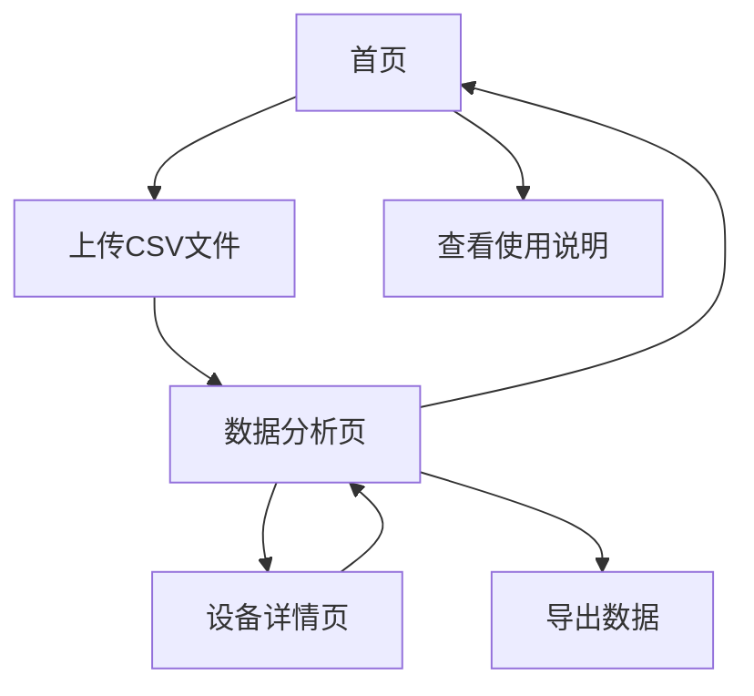

# 设备清单网站产品需求文档

## 1. Product Overview
设备清单网站是一个专门用于上传、解析和分析设备清单CSV文件的前端应用。用户可以上传从其他库存管理系统导出的CSV文件，系统会自动解析特殊格式的数据并提供多维度的数据分析功能。
- 解决企业设备清单数据分散、难以统计分析的问题，为设备管理人员和工程师提供直观的数据洞察。
- 目标是成为企业设备管理的数据分析助手，提升设备管理效率。

## 2. Core Features

### 2.1 Feature Module
我们的设备清单网站包含以下主要页面：
1. **首页**：文件上传区域、使用说明、示例数据展示
2. **数据分析页**：数据表格展示、统计图表、筛选搜索功能
3. **设备详情页**：单个设备的详细信息和零部件清单

### 2.2 Page Details

| Page Name | Module Name | Feature description |
|-----------|-------------|---------------------|
| 首页 | 文件上传区域 | 支持CSV文件拖拽上传，文件格式验证，上传进度显示 |
| 首页 | 使用说明 | 展示CSV文件格式要求，数据结构说明，示例数据预览 |
| 首页 | 导航菜单 | 页面导航，功能入口，品牌标识 |
| 数据分析页 | 数据表格 | 解析后的设备清单表格展示，支持排序、分页、导出 |
| 数据分析页 | 统计图表 | 设备数量统计、零部件分类统计、电机功率分布图表 |
| 数据分析页 | 筛选搜索 | 按设备编号、工作部位、零部件名称等条件筛选数据 |
| 数据分析页 | 数据汇总 | 设备总数、零部件总数、电机功率汇总等关键指标 |
| 设备详情页 | 设备信息 | 显示单个设备的基本信息和所有零部件清单 |
| 设备详情页 | 零部件列表 | 该设备下所有零部件的详细信息表格 |

## 3. Core Process

用户操作流程：
1. 用户访问首页，查看使用说明和示例数据
2. 用户上传CSV文件，系统自动解析数据格式
3. 系统处理特殊格式（空行继承设备编号和工作部位）
4. 跳转到数据分析页，展示解析后的数据表格和统计图表
5. 用户可以使用筛选搜索功能查找特定数据
6. 用户可以点击设备编号查看设备详情页
7. 用户可以导出分析结果或返回首页上传新文件

## 4. User Interface Design

### 4.1 Design Style
- **主色调**：深蓝色 (#1e40af) 和浅蓝色 (#3b82f6)，体现专业性和科技感
- **辅助色**：灰色 (#6b7280) 用于次要信息，绿色 (#10b981) 用于成功状态
- **按钮样式**：圆角按钮，悬停效果，主要按钮使用渐变色
- **字体**：中文使用微软雅黑，英文使用 Inter，标题 18px，正文 14px
- **布局风格**：卡片式布局，顶部导航栏，响应式设计
- **图标风格**：线性图标，统一的视觉风格，适当使用设备相关的图标

### 4.2 Page Design Overview

| Page Name | Module Name | UI Elements |
|-----------|-------------|-------------|
| 首页 | 文件上传区域 | 虚线边框的拖拽区域，上传图标，进度条，文件格式提示 |
| 首页 | 使用说明 | 卡片式布局，步骤图标，示例数据表格预览 |
| 首页 | 导航菜单 | 顶部固定导航栏，Logo，菜单项，响应式汉堡菜单 |
| 数据分析页 | 数据表格 | 斑马纹表格，固定表头，排序图标，分页控件 |
| 数据分析页 | 统计图表 | 柱状图、饼图、折线图，图例，数据标签，颜色区分 |
| 数据分析页 | 筛选搜索 | 搜索框，下拉选择器，标签筛选，清除按钮 |
| 数据分析页 | 数据汇总 | 数字卡片，图标，百分比显示，对比数据 |
| 设备详情页 | 设备信息 | 信息卡片，标题，描述性文字，返回按钮 |
| 设备详情页 | 零部件列表 | 详细表格，搜索功能，导出按钮，分类标签 |

### 4.3 Responsiveness
网站采用移动端优先的响应式设计，在桌面端、平板和手机上都能良好显示。针对触屏设备优化了按钮大小和交互体验，表格在小屏幕上支持横向滚动。