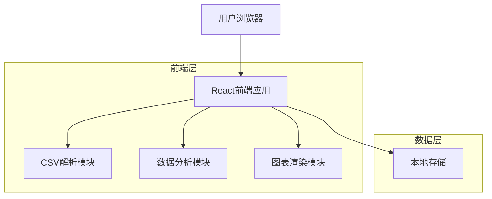

# 设备清单网站技术架构文档

## 1. Architecture design



## 2. Technology Description

* Frontend: React\@18 + TypeScript + Vite + TailwindCSS\@3

* 数据处理: PapaParse (CSV解析) + Lodash (数据操作)

* 图表库: Chart.js + React-Chartjs-2

* UI组件: Headless UI + Heroicons

* 状态管理: React Hooks (useState, useEffect, useContext)

* 存储: LocalStorage (临时数据缓存)

## 3. Route definitions

| Route       | Purpose             |
| ----------- | ------------------- |
| /           | 首页，文件上传和使用说明        |
| /analysis   | 数据分析页，展示解析后的数据和统计图表 |
| /device/:id | 设备详情页，显示单个设备的详细信息   |

## 4. 核心数据结构

### 4.1 CSV数据接口定义

```typescript
// 原始CSV行数据
interface RawCSVRow {
  设备编号: string;
  工作部位: string;
  零部件名称: string;
  型号规格: string;
  数量及米数: string;
  电机功率: string;
  备注: string;
}

// 处理后的设备数据
interface Device {
  id: string;
  设备编号: string;
  工作部位: string;
  零部件列表: Component[];
}

// 零部件数据
interface Component {
  id: string;
  零部件名称: string;
  型号规格: string;
  数量及米数: string;
  电机功率: string;
  备注: string;
}

// 统计数据
interface Statistics {
  设备总数: number;
  零部件总数: number;
  电机功率汇总: number;
  设备分类统计: Record<string, number>;
  零部件分类统计: Record<string, number>;
}
```

## 5. 核心功能模块

### 5.1 CSV解析模块

```typescript
// CSV文件解析和数据处理
class CSVParser {
  // 解析CSV文件
  parseFile(file: File): Promise<RawCSVRow[]>
  
  // 处理空行继承逻辑
  processInheritance(rows: RawCSVRow[]): Device[]
  
  // 数据验证
  validateData(rows: RawCSVRow[]): ValidationResult
}
```

### 5.2 数据分析模块

```typescript
// 数据统计和分析
class DataAnalyzer {
  // 生成统计数据
  generateStatistics(devices: Device[]): Statistics
  
  // 数据筛选
  filterDevices(devices: Device[], filters: FilterOptions): Device[]
  
  // 数据搜索
  searchDevices(devices: Device[], keyword: string): Device[]
  
  // 数据导出
  exportData(devices: Device[], format: 'csv' | 'json'): string
}
```

### 5.3 图表配置

```typescript
// 图表配置接口
interface ChartConfig {
  // 设备数量柱状图
  deviceCountChart: ChartConfiguration
  
  // 零部件分类饼图
  componentPieChart: ChartConfiguration
  
  // 电机功率分布图
  powerDistributionChart: ChartConfiguration
}
```

## 6. 文件结构

```
src/
├── components/           # React组件
│   ├── common/          # 通用组件
│   ├── upload/          # 文件上传组件
│   ├── analysis/        # 数据分析组件
│   └── charts/          # 图表组件
├── hooks/               # 自定义Hooks
├── utils/               # 工具函数
│   ├── csvParser.ts     # CSV解析工具
│   ├── dataAnalyzer.ts  # 数据分析工具
│   └── chartConfig.ts   # 图表配置
├── types/               # TypeScript类型定义
├── pages/               # 页面组件
└── App.tsx              # 主应用组件
```

## 7. 性能优化策略

* **文件处理**: 使用Web Workers处理大型CSV文件，避免阻塞主线程

* **数据缓存**: 使用LocalStorage缓存解析后的数据，避免重复处理

* **虚拟滚动**: 大数据量表格使用虚拟滚动技术提升渲染性能

* **懒加载**: 图表组件按需加载，减少初始包大小

* **防抖搜索**: 搜索功能使用防抖技术，减少不必要的计算

## 8. 错误处理

* **文件格式验证**: 检查CSV文件格式和必要字段

* **数据完整性检查**: 验证数据的完整性和合法性

* **用户友好提示**: 提供清晰的错误信息和解决建议

* **降级处理**: 部分数据错误时仍能正常显示其他数据

